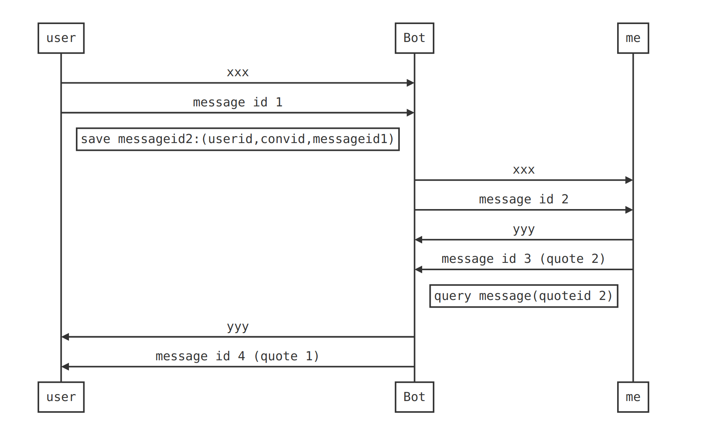

## How reply from bot works?

​	(Based on session and quote message)

1. User send message to bot
2. Bot got user id, conversation id, message id
3. Bot generate another message, bind the new message id with things in step 2 and store, send the new message to you.
4. You got the message, and send a message quoting the message bot sent to you.
5. Bot got your message, query session, got user's user_id and conversation id, copy your message to user.

```sequence
user->Bot: xxx
user->Bot: message id 1
Note left of Bot: save messageid2:(userid,convid,messageid1)
Bot->me : xxx
Bot->me : message id 2
me-> Bot: yyy
me-> Bot: message id 3 (quote 2)
Note right of Bot: query message(quoteid 2)
Bot->user: yyy
Bot->user: message id 4 (quote 1)
```


